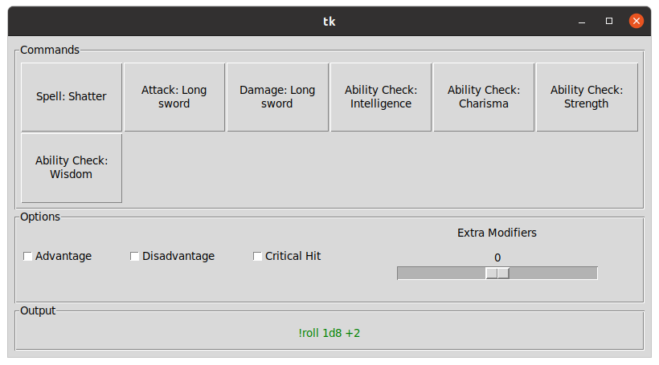

# dice-maiden-ui
Python app which helps to generate roll commands for the [dice maiden discord app](https://top.gg/bot/377701707943116800).

You create a configuration file listing the details of your commands. When running the app, you select your configuration file
which will generate the UI.

Before selecting the command you'd like to roll, select any options for the roll.
Then upon clicking a command button, the generated roll will be automatically copied to your clipboard.

# Installing the app

`pip install dice-maiden-ui`

# Running the app

1) Ensure you've created your configuration file - see the [configuration setup doc](documentation/config.md).
2) Run the app with either `dice_maiden_ui` or `python -m dice_maiden_ui`
3) In the top left, click `Open` and find your configuration file from step 1

